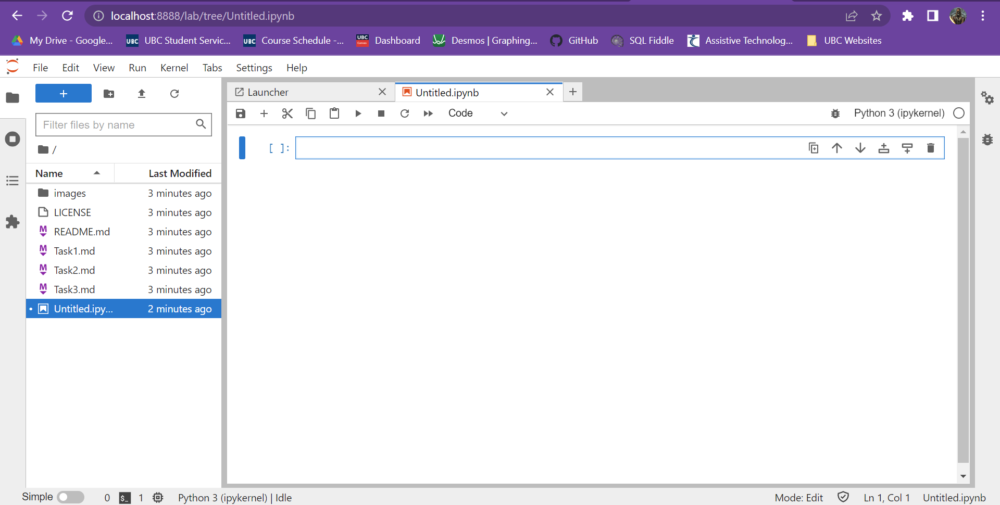

```print('hello world')```

```
num = 10
if num < 5:
    print('Number is less than 5.')
else:
    print('Number is greater than 5.')
```
---
[This is a link to the CBC](https://www.cbc.ca/)

 


| Fruit | Colour | Shape | Size |
| ----- | ------ | ----- | ---- |
| Grape | Purple | Round | Small |
| Apple | Red/Green | Sort of round? | Medium |
| I | Don't | Like | Any |
| Other | Fruits| I'm | Sorry |